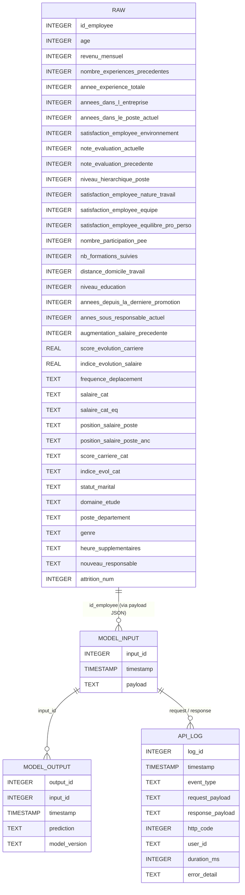

***

# Projet – Déploiement d’un modèle d’attrition dans une ESN

Ce projet déploie en production un modèle de Machine Learning prédictif de l’attrition des salariés au sein d’une ESN, via une API FastAPI, une base PostgreSQL, un frontend de démo (Gradio) et un pipeline CI/CD complet.

---

## Table des matières

- Contexte
- Objectifs
- Modèle de Machine Learning
- Base de données & scripts
- Arborescence du projet
- Préparation de l’environnement
- Utilisation & démarrage rapide
- API & déploiement Hugging Face
- Tests & couverture
- CI/CD & déploiement
- Organisation technique
- Contact

---

## Contexte

Ce projet s’inscrit dans la continuité du projet d’analyse "Attrition dans une ESN", où un modèle de Machine Learning a été conçu pour prédire le risque de départ volontaire à partir de données RH, d’évaluations et de sondages internes.

L’objectif ici est de déployer ce modèle dans une architecture proche de la production : API REST, base de données relationnelle, logs centralisés, tests automatisés et CI/CD vers un environnement de démo Hugging Face.

---

## Objectifs

- Mettre en production un modèle ML existant (XGBoost) via une API REST FastAPI.  
- Centraliser données et logs dans PostgreSQL puis les répliquer en SQLite pour un Space Hugging Face.  
- Fournir un frontend (Gradio) utilisable par les métiers pour des prédictions individuelles et une visualisation de l’explicabilité.  
- Mettre en place des tests unitaires et fonctionnels avec reporting de couverture.  
- Automatiser CI/CD (tests, lint, coverage, déploiement sur HF en test puis en prod).

---

## Modèle de Machine Learning

### Origine et type de modèle

- Modèle issu du projet précédent "Attrition ESN" (notebook `01_notebook.ipynb`).  
- Pipeline scikit-learn : préprocesseur (encodage, scaling, features dérivées) + classifieur XGBoost (`XGBClassifier`).

### Données et features

- 1470 salariés, avec des variables de profil, carrière, rémunération et satisfaction (features natives + features dérivées comme groupes de salaires, indices d’évolution et scores de carrière).

### Optimisation et seuil

- Optimisation des hyperparamètres par validation croisée avec métriques centrées sur le rappel et F2.  
- Seuil de décision fixé à 0,55 sur la probabilité de départ :
  - score ≥ 0,55 → prédiction "OUI" (risque de départ probable)  
  - score < 0,55 → prédiction "NON"

### Export et intégration API

- Pipeline final exporté en `models/model_pipeline.joblib` depuis le notebook.  
- L’API FastAPI charge ce pipeline au démarrage et l’utilise dans `predict_core`.  
- Explications locales générées avec SHAP et renvoyées sous forme de dict (`shap_waterfall`) et d’image waterfall encodée base64 (`shap_waterfall_img`).

---

## Base de données & scripts

### Schéma de la base de données

La base relationnelle utilisée par l’API est décrite dans `scripts/schema.sql`. Elle contient 4 tables principales :

#### Table `raw`

Table métier qui rassemble les features d’entrée du modèle, une ligne par salarié. C'est la source de données du modèle.

- `id_employee` INTEGER : identifiant salarié (clé logique).  
- `age` INTEGER
- `revenu_mensuel` INTEGER  
- `nombre_experiences_precedentes` INTEGER  
- `annee_experience_totale` INTEGER  
- `annees_dans_l_entreprise` INTEGER  
- `annees_dans_le_poste_actuel` INTEGER  
- `satisfaction_employee_environnement` INTEGER de 1 à 5 
- `note_evaluation_actuelle` INTEGER de 1 à 5
- `note_evaluation_precedente` INTEGER de 1 à 5
- `niveau_hierarchique_poste` INTEGER 
- `satisfaction_employee_nature_travail` INTEGER de 1 à 5
- `satisfaction_employee_equipe` INTEGER de 1 à 5
- `satisfaction_employee_equilibre_pro_perso` INTEGER de 1 à 5  
- `nombre_participation_pee` INTEGER  
- `nb_formations_suivies` INTEGER  
- `distance_domicile_travail` INTEGER en km  
- `niveau_education` INTEGER  
- `annees_depuis_la_derniere_promotion` INTEGER  
- `annes_sous_responsable_actuel` INTEGER  
- `augmentation_salaire_precedente` INTEGER : dernière augmentation exprimée en pourcentage
- `score_evolution_carriere` REAL : score combinant ancienneté, augmentation et niveau de salaire
- `score_carriere_cat` TEXT : version catégorielle du score précédent (Très bas, Bas, Moyen, Haut)
- `indice_evolution_salaire` REAL : ratio annuel de l’augmentation, indicateur de dynamique salariale.
- `indice_evol_cat` TEXT : : version catégorielle du score précédent (Très bas, Bas, Moyen, Haut)
- `frequence_deplacement` TEXT : Aucun, Occasionnel ou Fréquent 
- `salaire_cat` TEXT : Très bas, Bas, Moyen, Haut 
- `salaire_cat_eq` TEXT : idem réparti en quartiles
- `position_salaire_poste` TEXT : réparti par poste
- `position_salaire_poste_anc` TEXT : réparti par poste et ancienneté 
- `statut_marital` TEXT : Célibataire, Marié, Divorcé
- `domaine_etude` TEXT : domaine principal (Infra & Cloud, Transformation Digitale, Marketing, RH, etc.)
- `poste_departement` TEXT : nom concaténé du poste et du département  
- `genre` TEXT : M ou F
- `heure_supplementaires` TEXT : OUI ou NON  
- `nouveau_responsable` TEXT : OUI si `annes_sous_responsable_actuel` < 1 
- `attrition_num` INTEGER : target encodée 0/1 (sert uniquement pour le train et l'évaluation du modèle)

#### Table `model_input`

Journalisation des entrées envoyées au modèle (traçabilité des requêtes).

- `input_id` INTEGER : identifiant de la requête (PK technique / auto-incrément côté Postgres).  
- `timestamp` TIMESTAMP : date/heure de l’appel.  
- `payload` TEXT : JSON de la requête (ex. `{"id_employee": 1234}`).

#### Table `model_output`

Journalisation des sorties du modèle (résultat + version).

- `output_id` INTEGER : identifiant de sortie (PK technique).  
- `input_id` INTEGER : référence logique vers `model_input.input_id`.  
- `timestamp` TIMESTAMP : date/heure de la réponse.  
- `prediction` TEXT : JSON de la prédiction (score, classe, etc.).  
- `model_version` TEXT : version du modèle utilisé (ex. `"1.0"`).

#### Table `api_log`

Journalisation des événements API (monitoring, debug).

- `log_id` INTEGER : identifiant de log (PK technique).  
- `timestamp` TIMESTAMP : date/heure de l’événement.  
- `event_type` TEXT : type d’événement (`"predict"`, `"predict_error"`, `"health"`, …).  
- `request_payload` TEXT : JSON de la requête brute.  
- `response_payload` TEXT : JSON de la réponse (ou NULL en cas d’erreur).  
- `http_code` INTEGER : code HTTP renvoyé.  
- `user_id` TEXT : identifiant fonctionnel de l’utilisateur (si disponible).  
- `duration_ms` INTEGER : durée de traitement en millisecondes.  
- `error_detail` TEXT : détail d’erreur éventuel.

#### Vue d’ensemble

- `raw` alimente le modèle en features pour un `id_employee` donné.  
- `model_input` et `model_output` construisent une chaîne complète d’audit des appels au modèle.  
- `api_log` centralise tous les événements de l’API (succès, erreurs, temps de réponse), par-dessus les deux tables de logs modèle.

Ce schéma est utilisé à la fois en PostgreSQL (dev/prod interne) et cloné en SQLite pour le Space Hugging Face.

### Scripts

- `scripts/create_db.py` : création de la base PostgreSQL (table `raw`, tables de logs, droits pour `admin`, `log`, `demo`). La première partie de ce script est issu de l'analyse exploratoire des données brutes fournies initialement (3 fichiers CSV), il contient la fusion des fichiers, et le feature engineering. Dans le cas d'un fichier unique de données, seule la partie création et population des tables est utile. 
- `scripts/evaluate_db.py` : vérification des tables, aperçu de contenu, export complet de `raw` en CSV (`raw_full.csv`) et affichage des modalités catégorielles.  
- `scripts/log_check.py` : affiche les dernières lignes de `model_input`, `model_output`, `api_log`.  
- `scripts/pg_to_sqlite_export.py` : clone `raw`, `model_input`, `model_output`, `api_log` de PostgreSQL vers une base SQLite (utilisée sur HF).

---

## Arborescence du projet

~~~ bash
.
├── app/ # Code de l'API (FastAPI, endpoints)
├── data/ # Données brutes et traitées (non versionnées)
│ ├── raw/
│ └── processed/
├── models/ # Modèles ML exportés (model_pipeline.joblib)
├── notebooks/ # Notebooks d'exploration et d'entraînement
├── scripts/ # Scripts BDD, export, outils
├── tests/ # Tests unitaires et fonctionnels (Pytest)
├── presentation/ # Supports de présentation (.pptx, .pdf)
├── README.md # Documentation principale (ce fichier)
├── README_HF.md # Détail API & déploiement HF
├── pyproject.toml # Gestion des dépendances (uv)
├── requirements.txt # Dépendances pip
└── .github/workflows/ # Pipelines CI/CD (ci.yml, release-to-test, release-to-prod, etc.)
~~~

---

## Préparation de l’environnement

### Avec `conda` (recommandé)

1. Installer `conda` (selon votre OS)

2. Initialiser :

~~~ bash
conda create -n attrition-esn python=3.10
conda activate attrition-esn
~~~
---

## Utilisation & démarrage rapide

### 1. Cloner le dépôt

~~~ bash
git clone https://github.com/Kisai-DG-SLU/attrition-esn-model.git
cd attrition-esn-model
~~~

### 2. Installer les dépendances

Avec `conda` :

~~~ bash
pip install -r requirements.txt
~~~

### 3. Préparer la base PostgreSQL

Configurer `.env` :

~~~ bash
DB_NAME=...
DB_SYS_HOST=...
DB_SYS_PORT=5432
DB_USER_ADMIN=...
DB_PW_ADMIN=...
DB_USER_LOG=...
DB_PW_LOG=...
DB_USER_DEMO=...
DB_PW_DEMO=...
~~~

Initialiser :

~~~ bash
python scripts/create_db.py
~~~

Contrôler (optionnel) :

~~~ bash
python scripts/evaluate_db.py
python scripts/log_check.py
~~~

### 4. Lancer l’API en local (adapter l'host et l'url si distant)

~~~ bash
uvicorn app.api:app --reload --host 0.0.0.0 --port 8000
~~~

- Swagger UI : `http://localhost:8000/docs`.
- ReDoc : `http://localhost:8000/redoc`.

### 5. Lancer le frontend Gradio en local (adapter l'host et l'url si distant)

~~~ bash
python gradio_frontend.py
~~~

- Interface : `http://localhost:7860`, connectée à l’API locale.

---

## API & déploiement Hugging Face

L’API et le frontend sont déployés sur un Space Hugging Face de test, alimenté depuis la branche `test` via un workflow GitHub Actions.

- La documentation détaillée de l’API, des endpoints et des scénarios d’utilisation est disponible dans [`README_HF.md`](./README_HF.md).

---

## Tests & couverture

Les tests sont dans `tests/` :

- Tests unitaires (`test_unit_api.py`) :
  - `log_model_input`, `log_model_output`, `log_api_event`
  - `get_raw_employee`
  - `predict_core` et branches SHAP / fallback  

- Tests fonctionnels (`test_functional_api.py`) :
  - `/health`, `/employee_list`, `/predict` (GET/POST), `/log_sample`
  - Base SQLite de test isolée via `conftest.py`

Commandes locales :

~~~ bash
pytest
coverage run -m pytest tests/
coverage report --show-missing
coverage html
~~~

---

## CI/CD & déploiement

### CI – Qualité & tests

Workflow : `.github/workflows/ci.yml` :

- Formatage (Black) et lint (Ruff).  
- Tests Pytest + coverage.  
- Publication du rapport HTML de couverture sur `gh-pages`.

### CD – Environnement de test (HF)

Workflow : `.github/workflows/release-to-test.yml` :

- Déclenché manuellement ou automatiquement après succès de la CI.  
- Copie les fichiers nécessaires de `main` vers `test` (API, README_HF, requirements HF), renomme pour HF (`README.md`, `requirements.txt`) et nettoie les artefacts dédiés.  
- Pousse la branche `test` vers le Space HF de test.

### CD – Environnement de prod (HF) (recommandé)

Un workflow similaire (`release-to-prod.yml`) :

- Utilise `test` comme source (après validation fonctionnelle).  
- Mise à jour de la branche `prod` et du Space HF "prod" séparé.

### Workflow complet

---

## Organisation technique

- Outils : Python 3.10+, FastAPI, Uvicorn, scikit-learn, XGBoost, SHAP, SQLAlchemy, Gradio, conda, pytest.  
- Préprocessing & features : feature engineering avancé dans `01_notebook.ipynb`.  
- Logs & observabilité : tables `model_input`, `model_output`, `api_log` alimentées automatiquement par l’API.  
- Sécurité & secrets : variables d’environnement (.env) pour credentials BDD, PAT GitHub, token HF (non versionnés).

---

## Contact

- Auteur : Damien GUESDON / Kisai DG SLU  
- Dépôt GitHub : `https://github.com/Kisai-DG-SLU/attrition-esn-model`

Projet réalisé dans le cadre de la formation OpenClassrooms – AI Engineer.
