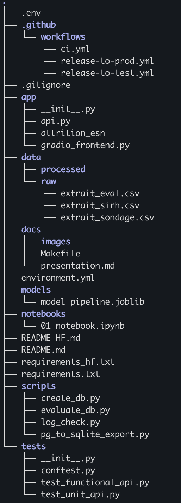
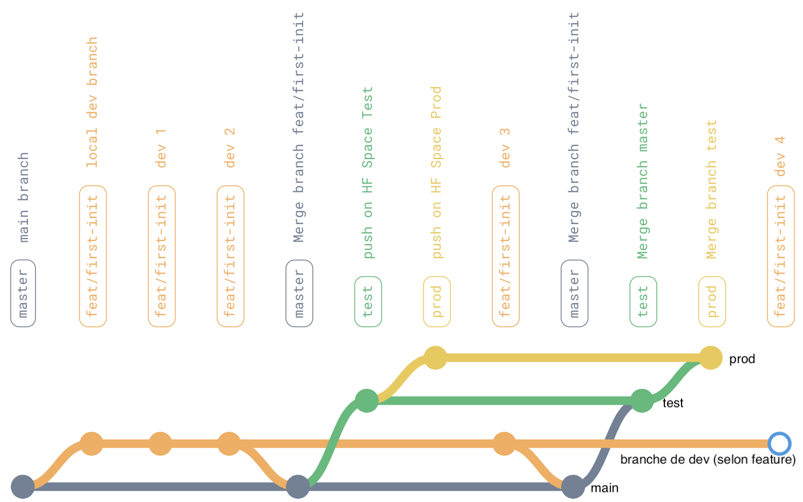
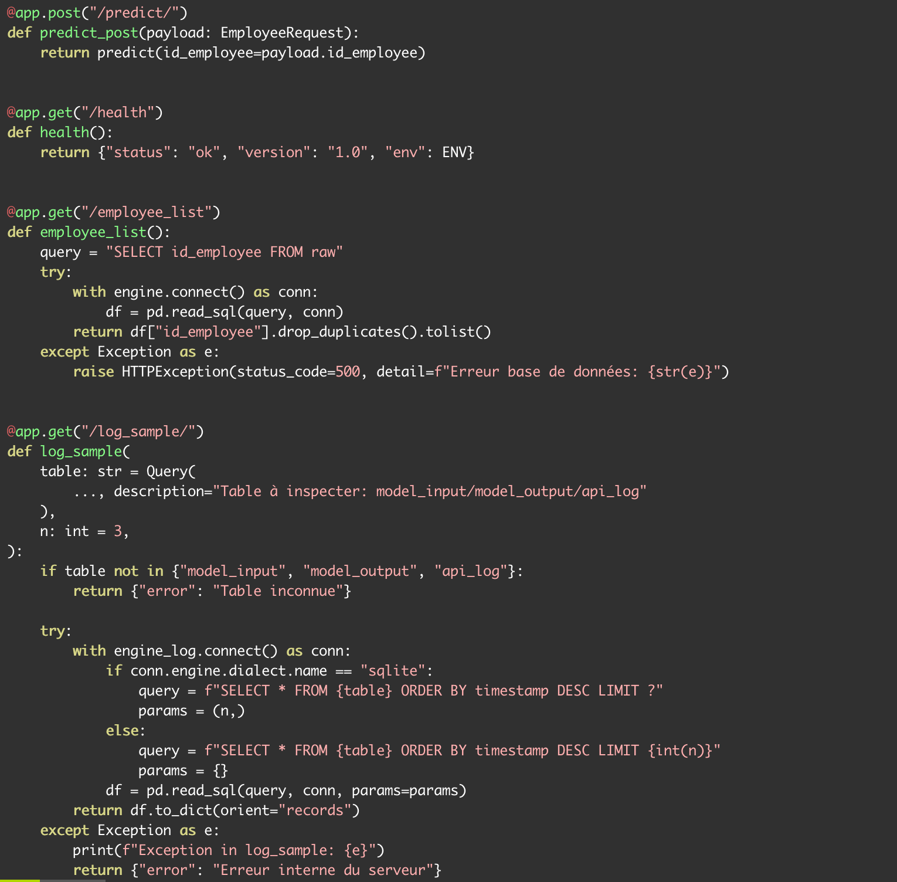
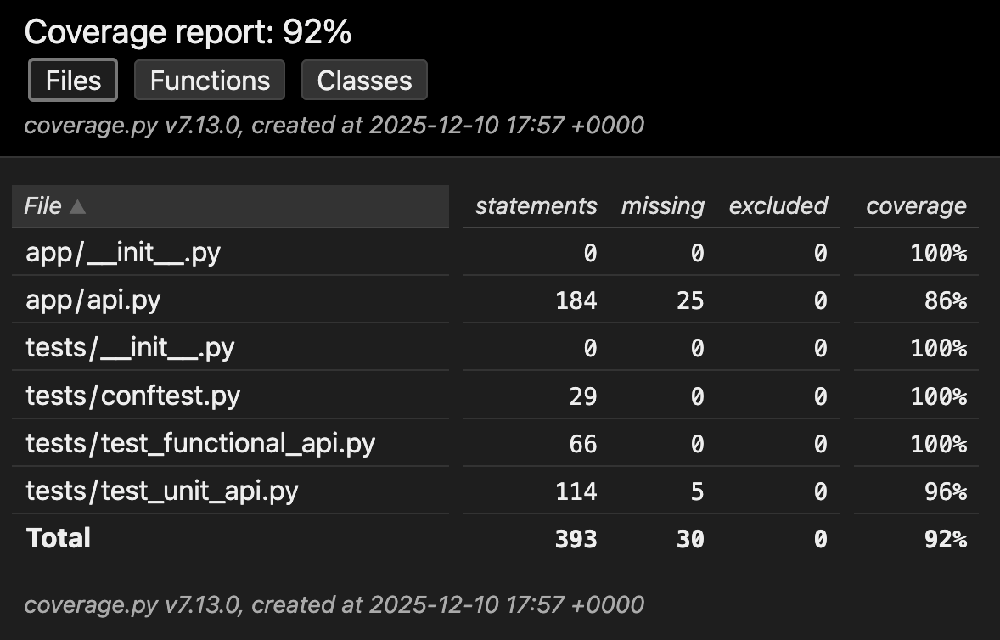
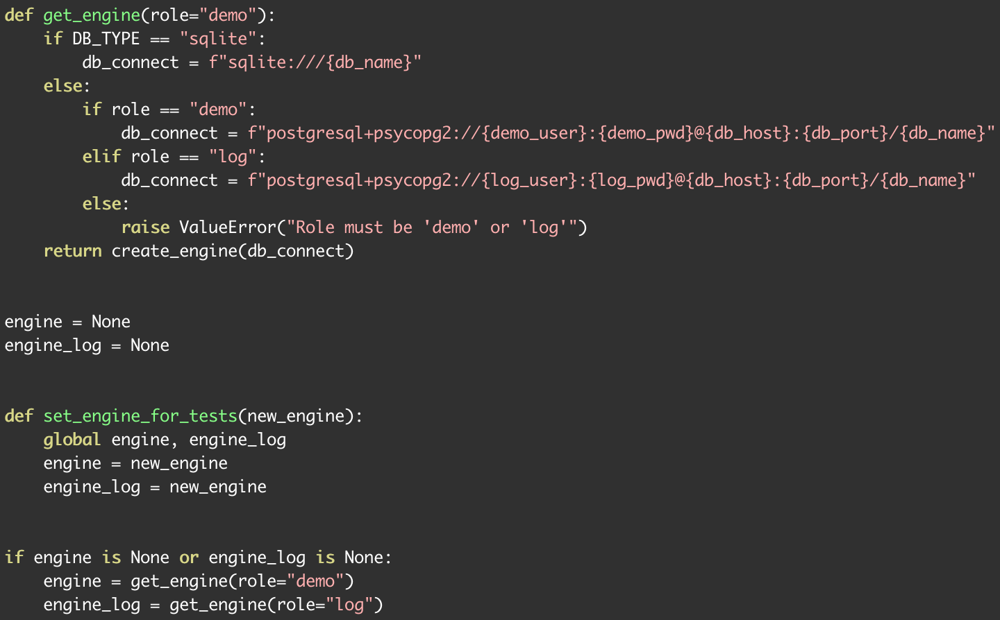
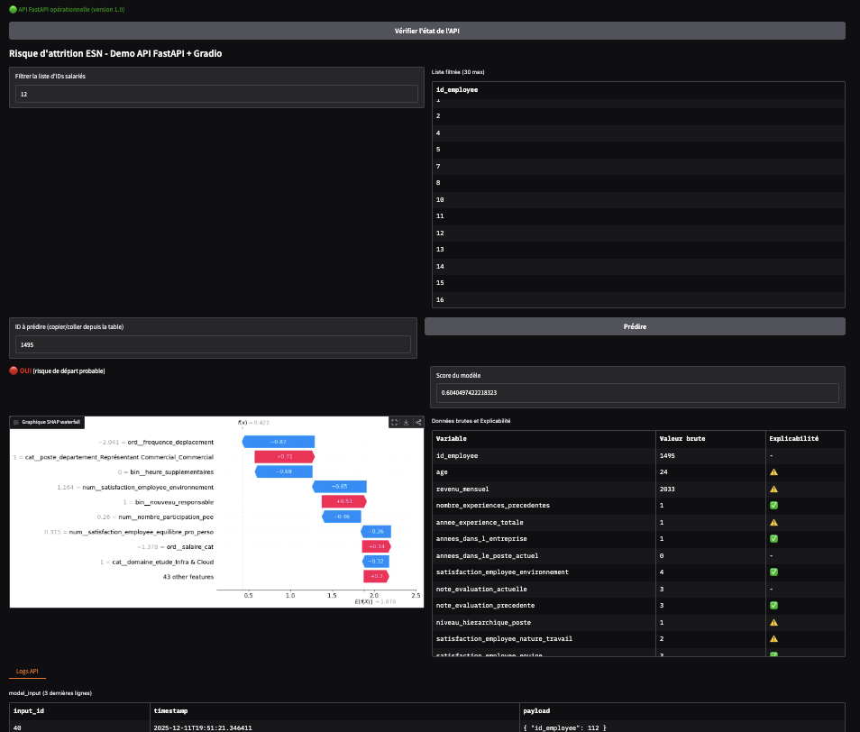

<!-- _class: invert -->

# Déploiement d'un modèle de Machine Learning
## Soutenance Projet 5 - Attrition ESN

**Damien Guesdon**
*Rôle : Machine Learning Engineer*
*Destinataire : Resp. Technique (Futurisys)*
*Date : Décembre 2025*

<!-- note:
Bonjour.
Je vous présente aujourd'hui l'industrialisation du modèle de prédiction d'attrition pour TechNova.
L'objectif de cette mission était de passer d'un notebook d'analyse à une architecture logicielle robuste, testée et déployée.
J'ai structuré la présentation selon les 5 livrables attendus : Git, API, Tests, BDD et Résultats.
-->

---

# 1. Structure du Dépôt Git & Workflow

### Architecture Modulaire
- **`app/`** : API FastAPI & Frontend Gradio.
- **`data/` & `scripts/`** : Gestion des données et BDD.
- **`tests/`** : Tests unitaires et fonctionnels.
- **Racine** : Fichiers de configuration (`environment.yml`, `requirements.txt`) et workflows CI/CD.

### Workflow Git
- Branches : `main`, `feat/<feature>` (dev),  `test` (HF **Test**), `prod` (HF **Production**)
- Tags sémantiques pour les releases. 

<!-- note:
J'ai structuré le projet pour séparer clairement le code applicatif, la logique de données et les tests qualité.
L'usage de Conda en local me permet de gérer finement les environnements, tandis que le requirements.txt assure la reproductibilité dans la CI/CD.
-->

---

# 2. Pipeline CI/CD (Workflow GitOps)

Stratégie à 3 niveaux pour garantir la qualité et la sécurité.

- **Optimisation :** Déploiement sélectif (uniquement `app/`) vers Hugging Face.
- **Sécurité :** Injection des secrets (`HF_TOKEN`) à la volée.

<!-- note:
C'est le cœur de l'industrialisation.
Le pipeline CI bloque tout code non conforme.
Le déploiement se fait en cascade : d'abord sur un environnement de test, puis, après validation, en production.
C'est une approche professionnelle qui minimise les risques de régression.
-->

---

# 3. API FastAPI & Documentation

L'API (`app/api.py`) est le point d'entrée unique du système.

### Fonctionnalités
- **Prédiction :** `POST /predict/` (avec log automatique).
- **Observabilité :** `GET /log_sample/` (contrôle des logs).
- **Santé :** `GET /health` (versionning).

### Documentation
- **Swagger UI / ReDoc :** Intégré et interactif.
- **Pydantic :** Validation stricte des données entrantes.

### Extrait `api.py`

<!-- note:
L'API expose le modèle de manière sécurisée.
Chaque requête est validée par Pydantic et loguée en base de données avant même d'être traitée.
Cela garantit une traçabilité totale des décisions du modèle.
-->

---

# 4. Tests & Qualité (Pytest)

Couverture élevée (**~86%**) garantissant la robustesse.

### Stratégie de Tests
- **Unitaires (`test_unit_api.py`) :**
  - Isolation via **Mock** (BDD, Modèle).
  - Teste la logique interne.
- **Fonctionnels (`test_functional_api.py`) :**
  - Simulation HTTP complète (`Test Client`).
  - Vérification des codes erreurs (404, 422).

### Rapport de Couverture

*(Généré par la CI via `coverage run`)*

<!-- note:
La qualité logicielle est validée par une suite de tests complète.
Les tests unitaires vérifient la logique métier, tandis que les tests fonctionnels valident le comportement de l'API dans son ensemble.
Un rapport de couverture est généré à chaque commit pour s'assurer qu'on ne baisse pas la garde.
-->

---

# 5. Base de Données : Stratégie Hybride

Adaptation pragmatique aux contraintes d'infrastructure.

### Architecture Duale
1. **Dev (Local) : PostgreSQL**
   - Robustesse, types forts.
   - Script `create_db.py`.
2. **Prod (HF Spaces) : SQLite**
   - Portabilité (Fichier `.sqlite`).
   - Script de migration `pg_to_sqlite_export.py`.

### Schéma Audit (`schema.sql`)
- `model_input` & `model_output`.

### Abstraction SQLAlchemy

*Le code de l'application ignore la BDD sous-jacente.*

<!-- note:
Pour gérer la persistance sur des environnements conteneurisés éphémères (Hugging Face), j'ai opté pour une stratégie hybride.
Je développe sur PostgreSQL pour la rigueur (la gestion des droits), et je déploie sur SQLite pour la simplicité.
Une couche d'abstraction (SQLAlchemy) rend le code applicatif totalement agnostique du moteur de base de données.
-->

---

# 6. Cas d'Usage & Résultats

Le modèle **XGBoost** au service de la rétention des talents.

### Interface Métier (Gradio)
- **Utilisateur :** RH.
- **Action :** Saisir ID Employé -> Obtenir Risque.
- **Plus-value :** Explicabilité **SHAP**.

### Performance
- **Métrique :** Optimisation du **Recall**.
- **Pourquoi ?** Ne rater aucun départ potentiel (Coût Faux Négatif > Coût Faux Positif).

### Démonstration
- **Score de risque** (ex: 60%)
- **Facteurs clés :**
  - *Fréquence des déplacements*
  - *Heures supplémentaires*
  - *Satisfaction Environnement*

<!-- note:
L'interface finale permet aux RH d'identifier les profils à risque.
L'intégration native des graphiques SHAP permet de comprendre les causes racines du risque (salaire, distance, etc.), transformant la prédiction en plan d'action.
-->

---

# 7. Conclusion & Débrief

### Bilan Technique
- ✅ **Architecture Propre :** Séparation API / Data / Tests.
- ✅ **Pipeline DevOps :** CI/CD complet (Lint, Black, Test, Deploy).
- ✅ **Observabilité :** Système de logs prêt pour le monitoring.

### Défis Relevés
1. **Parité BDD :** Gestion transparente Postgres/SQLite via SQLAlchemy.
2. **Gestion des Secrets :** Sécurisation des accès dans un contexte Open Source.

**Place aux questions.**

Damien Guesdon - Projet 5 OpenClassrooms

